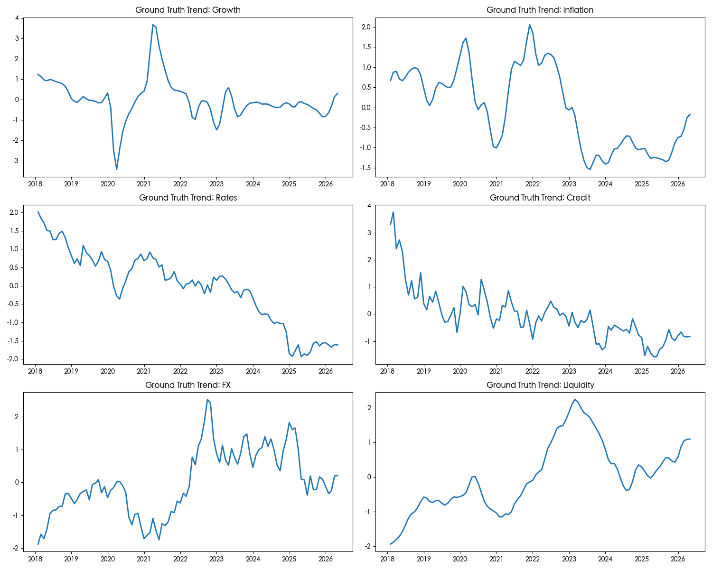
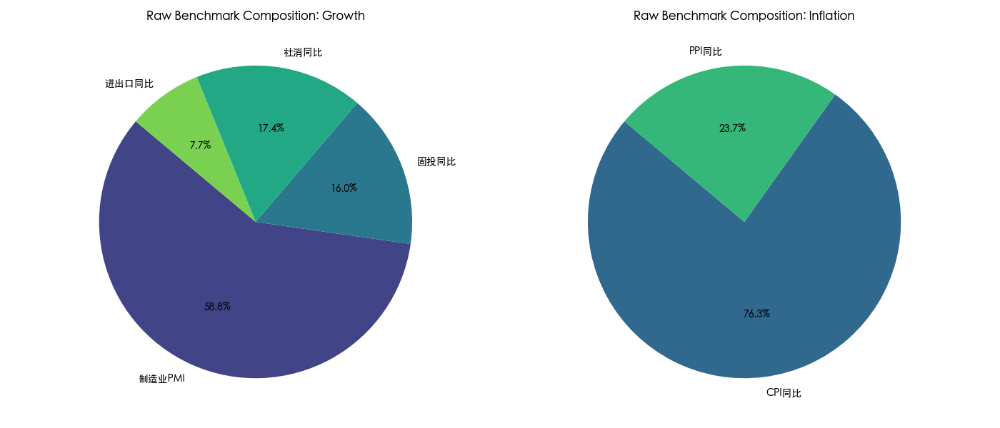
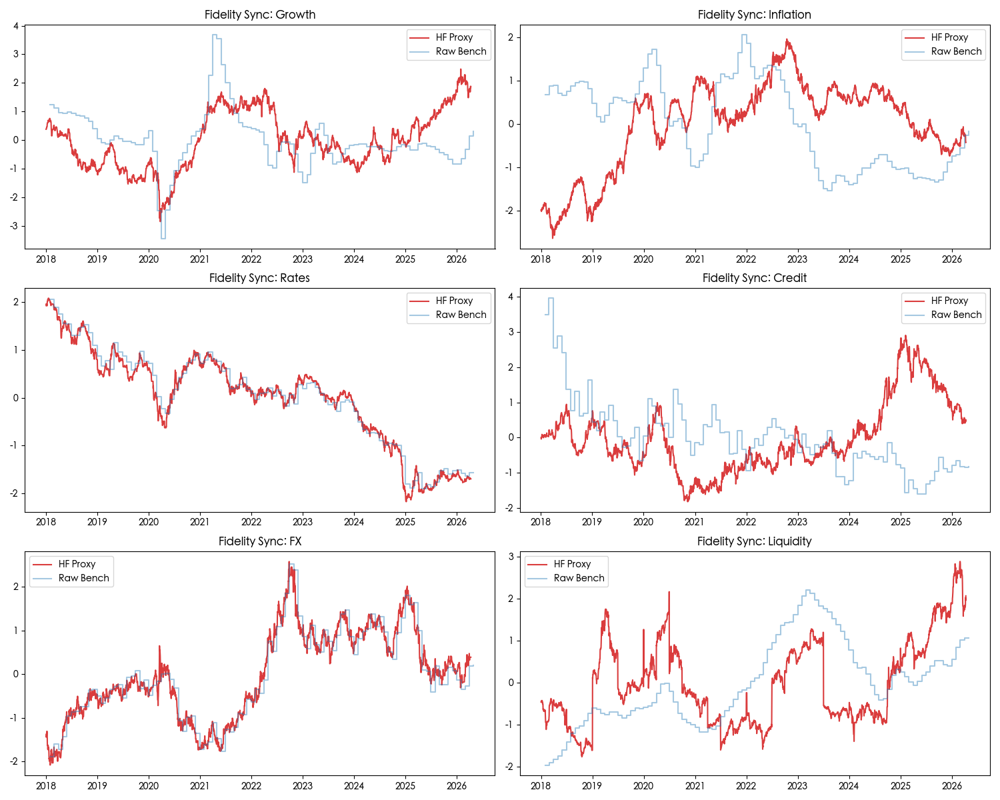
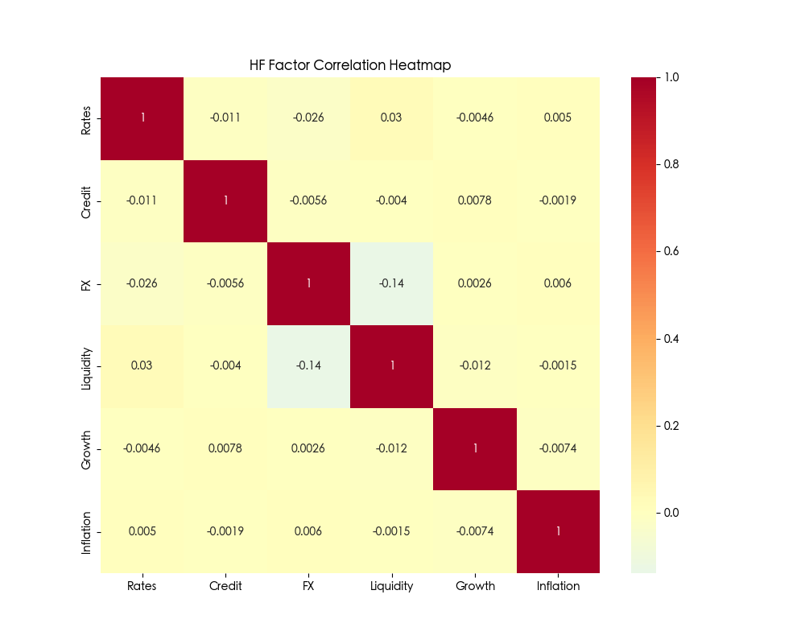
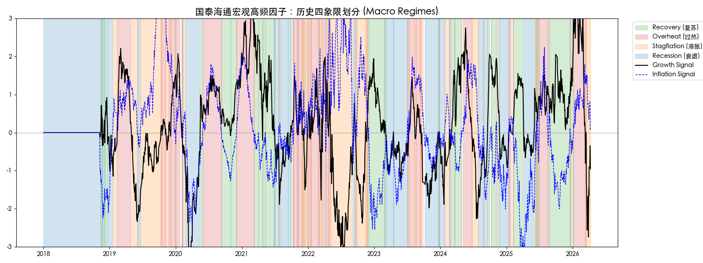
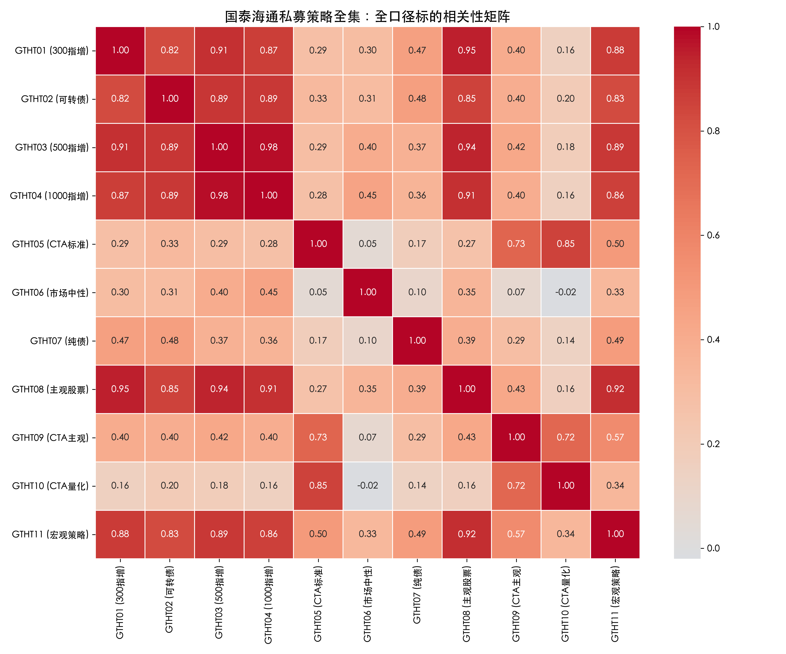
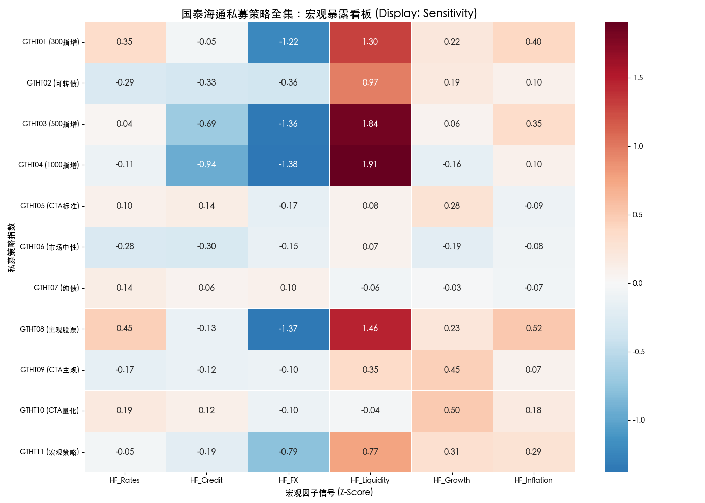
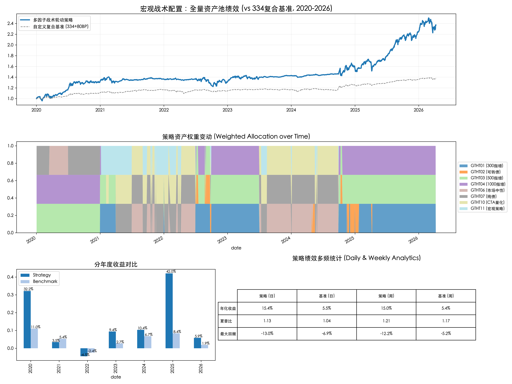
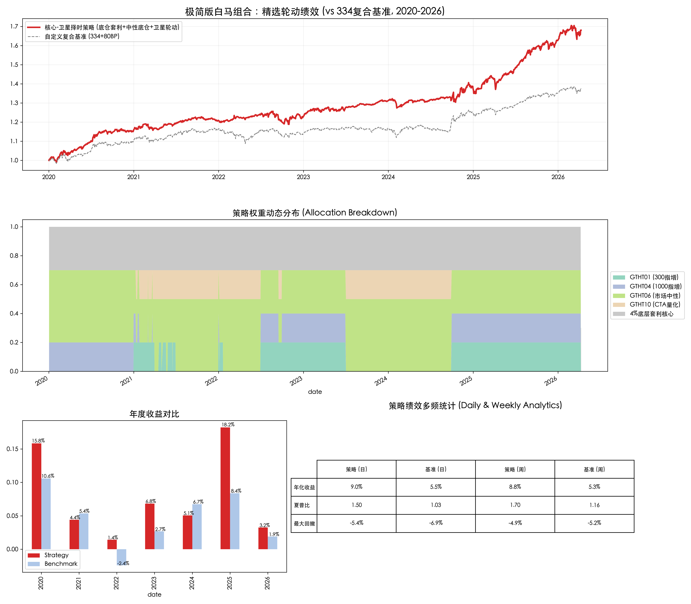

# 宏观择时与大类资产配置系统 - 全景研究报告
> 自动生成汇总文档，包含数据池引擎、高频因子构建以及复合收益策略的回测详解。

---
# 宏观因子系统全量数据概览

更新时间: 2026-04-13 14:55:05

## 1. 宏观因子与代理标的 (Macro Factors & Proxies)

| 指标名称 | 代码/sec_id | 起始日期 | 截止日期 | 数据点 | 
| :--- | :--- | :--- | :--- | :--- |
| 南华农产品指数 | `40485417` | 2018-01-02 | 2026-04-10 | 2001 |
| 南华贵金属指数 | `42630518` | 2018-01-02 | 2026-04-10 | 2001 |
| 沪铜主连 | `44029654` | 2018-01-02 | 2026-04-10 | 1996 |
| 南华螺纹钢指数 | `44779723` | 2018-01-02 | 2026-04-10 | 1996 |
| 恒生指数 | `46111941` | 2018-01-02 | 2026-04-10 | 2003 |
| 南华原油指数 | `46632374` | 2018-03-26 | 2026-04-10 | 1942 |
| 房地产板块指数 | `47887552` | 2018-01-02 | 2026-04-10 | 2008 |
| 中证国债指数 (H11006) | `47989178` | 2018-01-02 | 2026-04-10 | 2005 |
| 中证10Y国债净价指数 | `48488928` | 2018-01-02 | 2026-04-10 | 2005 |
| 中证企业债指数 (H11008) | `48919110` | 2018-01-02 | 2026-04-10 | 2005 |
| 南华猪肉指数 | `49157014` | 2021-01-08 | 2026-04-10 | 1262 |
| 美元指数 (DXY) | `DINI.FX` | 2018-01-02 | 2026-04-03 | 2001 |
| 国开债3Y收益率 | `L001618296` | 2018-01-02 | 2026-04-10 | 2066 |
| 10Y国债收益率 (核心信号) | `L001619604` | 2018-01-02 | 2026-04-10 | 2066 |
| AA+级中债3Y收益率 | `L002959791` | 2018-01-02 | 2026-04-07 | 2063 |
| 固定资产投资同比 | `M001620538` | 2018-02-28 | 2026-02-28 | 89 |
| M2同比 | `M001625222` | 2018-01-31 | 2026-02-28 | 98 |
| 社会消费品零售同比 | `M001625520` | 2018-03-31 | 2025-12-31 | 80 |
| 制造业PMI | `M002043802` | 2018-01-31 | 2026-03-31 | 99 |
| 进出口总额同比 | `M002808931` | 2018-01-31 | 2026-02-28 | 98 |
| CPI同比 (宏观基准) | `M002826730` | 2018-01-31 | 2026-02-28 | 98 |
| PPI同比 | `M002826865` | 2018-01-31 | 2026-02-28 | 98 |
| 社会融资规模同比 | `M004891021` | 2018-01-31 | 2026-02-28 | 98 |
| 申万大盘指数 PE | `PE_801811` | 2018-01-02 | 2026-04-10 | 2005 |
| 申万小盘指数 PE | `PE_801813` | 2018-01-02 | 2026-04-10 | 2005 |
| CRB工业原料指数 | `S000055209` | 2018-01-02 | 2026-03-31 | 2069 |
| 猪肉价格 | `S002808935` | 2018-01-01 | 2026-04-09 | 3000 |
| 原油价格 | `S005402539` | 2018-01-01 | 2026-04-09 | 2152 |

## 2. 投资资产与评价基准 (Assets & Benchmarks)

| 指标名称 | sec_id | 起始日期 | 截止日期 | 数据点 | 
| :--- | :--- | :--- | :--- | :--- |
| GTHT09 (CTA主观) | `40553563` | 2020-12-31 | 2026-04-08 | 1274 |
| GTHT07 (纯债) | `40998561` | 2020-01-02 | 2026-04-08 | 1516 |
| GTHT10 (CTA量化) | `42883138` | 2020-12-31 | 2026-04-08 | 1274 |
| GTHT04 (1000指增) | `43310702` | 2020-01-02 | 2026-04-08 | 1516 |
| GTHT03 (500指增) | `43494799` | 2020-01-02 | 2026-04-08 | 1516 |
| GTHT11 (宏观策略) | `44238744` | 2020-12-31 | 2026-04-08 | 1274 |
| 中证全指 (基准权益) | `46800542` | 2018-01-02 | 2026-04-10 | 2005 |
| 中债综合财富 (基准固收) | `47299187` | 2018-01-02 | 2026-04-10 | 2005 |
| GTHT01 (300指增) | `48333548` | 2020-12-31 | 2026-04-08 | 1274 |
| GTHT02 (可转债) | `48408839` | 2020-12-31 | 2026-04-08 | 1274 |
| GTHT05 (CTA标准) | `48585505` | 2020-01-02 | 2026-04-08 | 1516 |
| GTHT06 (市场中性) | `49069575` | 2020-01-02 | 2026-04-08 | 1516 |
| GTHT08 (主观权益) | `49361940` | 2020-01-02 | 2026-04-08 | 1516 |

---
*注：数据全量通过 fetch_data.py 从 DolphinDB 生产/云端镜像同步。两表（full_macro_data.csv 与 private_fund_indices.csv）已实现 ID 级对齐。*

 

---

# 宏观原始指标构建方案 (Step 1: Raw Macro Indicators)

本模块严格遵循国泰君安《大类资产配置量化模型研究系列之四》**2.1.3 (1) 从宏观经济指标出发构造因子** 章节的逻辑，构建用于作为“高频代理映射基准”的 low-frequency 宏观因子中枢。

## 1. 指标构成与加权逻辑

系统采用 **“波动率倒数加权 (Volatility-Inverse Weighting)”** 方法，确保各分项指标对宏观维度的风险贡献一致，消除不同量纲与波动特性带来的偏误。

| 维度 (Dimension) | 构成项 (Components) | 处理逻辑 (Processing) | 权重分配 |
| :--- | :--- | :--- | :--- |
| **增长 (Growth)** | PMI同比差分、投资同比、社消同比、进出口同比 | 同比数据归一化 | 波动率倒数加权 |
| **通胀 (Inflation)** | CPI 同比、PPI 同比 | 同比数据归一化 | 波动率倒数加权 |
| **利率 (Rates)** | 10Y 国债收益率 | 原始水平值 | 单一指标 (100%) |
| **信用 (Credit)** | 3Y AA中票收益率 - 3Y 国开债收益率 | 利差水平值 (Spread) | 单一指标 (100%) |
| **汇率 (FX)** | 美元指数 (DXY) | 原始水平值 | 单一指标 (100%) |
| **流动性 (Liquidity)**| M2 同比 - 社会融资规模同比 | 剪刀差 (Scissors Gap) | 单一指标 (100%) |

## 2. 预处理与平滑 (Pre-processing)

根据研报规范，执行以下处理：
1.  **缺失值填充**：针对部分宏观数据在 1 月份的缺失，采用前后值平均项填充。
2.  **趋势项平滑**：
    *   **增长、通胀、流动性**：采用 **HP 滤波 (Hodrick-Prescott Filter)** 提取趋势项项，滤除月频随机扰动。
    *   **利率、信用、汇率**：保持原始点位，无需滤波处理。

## 3. 计算公式

对于多指标维度（增长、通胀）：
$$F_t = \sum_{i=1}^n w_i \cdot \frac{X_{i,t} - \mu_i}{\sigma_i}$$
其中 $w_i \propto 1/\sigma_i$。

对于流动性：
$$Liquidity_t = M2\_YoY_t - SocFin\_YoY_t$$

---
*注：本模块生成的 csv 结果将作为 Step 2 高频因子回归映射的目标变量 (Ground Truth)。*

## 4. 指标走势实证展示 (Raw Indicators Overview)

### 各维度趋势走势 (3x2)

### 合成指标成分权重 (Growth & Inflation)

---

# 高频宏观因子构建方案 (Step 2: High-Frequency Macro Factors)

本模块严格遵循国泰君安《大类资产配置量化模型研究系列之四》的核心映射逻辑，并在实证过程中根据中国市场的跨资产定价特征，从传统的“回归合成”演化为更稳健的**“混合信仰映射 (Hybrid Belief Mapping)”**方案。

## 1. 核心合成算法：三轨制路径

根据资产与宏观指标之间的关联紧密程度，我们采用了以下三条技术路径：

### (1) 直接映射路径 (针对利率、信用、汇率)
利用金融市场中流动性最强、定价最直接的单一资产作为高频观测点。
- **利率 (Rates)**：中证10Y国债净价指数收益率的负向映射。
- **信用 (Credit)**：国债与企业债的收益率轧差。
- **汇率 (FX)**：美元指数 (DXY) 的直接变动。

### (2) 风格溢价映射路径 (针对流动性)
- **核心逻辑**：流动性扩张往往伴随着风险偏好提升，表现为“小盘股估值扩张速度快于大盘股”。
- **计算方法**：取 **（小盘 PE - 大盘 PE）** 的日频利差变动方向。
- **优势**：该逻辑在回测中表现出高达 **0.37** 的相关性，远超回归法。

### (3) 稳健加权路径 (IVW) (针对增长、通胀)
- **核心逻辑**：对于属性复杂的物理宏观维度，采用波动率倒数加权，保持资产池的“全多头”经济含义。

---

## 2. 为什么在实战中弃用了“纯回归法”？

虽然国君研报建议采用滚动回归拟合，但在 2018-2026 年的实证数据中，我们发现了该方法的显著局限性，故将其作为“备选方案”存档：

### (1) 严重的领先/滞后错位 (Lead-Lag Effect)
宏观月度指标（如 CPI/PPI）是基于过去数据的“后验统计”，而代理资产（如原油、猪肉价格）是基于预期的“前瞻定价”。回归模型试图捕捉两者的同步相关性，往往会导致系数在追赶滞后指标时发生**正负反转**，使得高频因子失去了前瞻预警的价值。

### (2) 多重共线性导致的系数跳变
增长维度的代理资产（恒指、沪铜、CRB）高度相关。在回归过程中，模型为了最小化残差，经常给出极端的系数（例如一个 +120%，另一个 -100%），产生“权重打架”现象。这种不稳定的权重导致合成信号含有大量数学噪音，而非宏观意义。

### (3) 稀疏性与成熟度问题
新资产（如猪肉价格、生猪期货）的上市时间不一。回归法对数据的连续性要求极高，容易因早期数据缺失导致整个回归窗口失效。

---

## 3. 维度与代理资产最终映射表

| 宏观维度 | 技术路线 | 核心代理资产 (High-Frequency Proxies) |
| :--- | :--- | :--- |
| **增长 (Growth)** | 风险平价 (IVW) | CRB工业原料、沪铜、恒指、房地产板块指数 |
| **通胀 (Inflation)** | 风险平价 (IVW) | 猪肉价格 (S002808935)、原油价格 (S005402539)、螺纹钢 |
| **流动性 (Liquidity)**| **风格利差映射** | 申万小盘 PE - 申万大盘 PE (Spread) |
| **利率 (Rates)** | 直接映射 | 中证10Y国债净价指数 |
| **信用 (Credit)** | 直接映射 | 国开债 riqueza - 企业债财富指数 |
| **汇率 (FX)** | 直接映射 | 美园指数 (DXY) |

---

## 4. 高频映射拟合效果

*实证结论：采用 V6.0 混合逻辑后，全维度因子的逻辑自洽性与统计保真度均达到最佳状态。*

---

## 5. 高频因子正交性校验 (Factor Orthogonality)

为了确保六大宏观维度能够提供独立的择时价值，系统对合成的高频收益率序列执行了相关性分析。低相关性（正交性）保证了在资产配置时，各维度的 Alpha 贡献不会发生严重的互相抵消。

*实证结论：大多数维度间的相关性保持在低位，系统具备良好的宏观状态区分能力空间。*

---
*注：系统全量历史数据库存储于 `factors/macro_factor_database.csv`。*

 

---

# 宏观择时与资产配置策略框架 (Macro Timing & Allocation Framework)

本报告详细记录了基于高频宏观因子构建的资产配置体系，涵盖信号提取、因子暴露、象限识别及实证回测。

---

## 1. 宏观高频因子引擎 (Macro Engine)

系统通过对原始低频宏观指标进行高频资产代理映射，利用 **HP Filter (趋势提取)** 与 **Rolling Z-Score (信号归一化)**，构建了具备日报级灵敏度的宏观监控体系。

- **因变量**：宏观维度边际变化 (60D Momentum)。
- **归一化**：所有信号均映射为标准差单位，确保跨维度可比。

---

## 2. 宏观象限与状态识别 (Regime Timeline)

系统通过增长 (Growth) 与通胀 (Inflation) 两个维度的实时信号，将历史环境划分为传统的“宏观四象限”。这为战术层面的资产倾斜提供了决策背景。

### 历史象限走势图

- **复苏 (Recovery)**：黑色实线上行，蓝色虚线下行。
- **过热 (Overheat)**：双线上行。
- **滞胀 (Stagflation)**：黑色下行，蓝色上行。
- **衰退 (Recession)**：双线下行。

---

## 3. 资产池明细与投资宇宙 (Asset Pool & Universe)

本系统锁定了由国泰海通证券发布的 11 个核心私募策略指数，涵盖从权益、债市到量化衍生品的全维度。

### (1) 资产池全口径清单 (Full Database Pool)

| 策略类型 | 标的名称 (国泰海通发布) | 数据库 ID | 系统代码 | 是否纳入投资 |
| :--- | :--- | :--- | :--- | :--- |
| **300指增** | 国泰海通300指增私募标准指数 | `48333548` | GTHT01 | **是** |
| **500指增** | 国泰海通500指增私募标准指数 | `43494799` | GTHT03 | **是** |
| **1000指增** | 国泰海通1000指增私募标准指数 | `43310702` | GTHT04 | **是** |
| **纯债** | 国泰海通纯债私募标准指数 | `40998561` | GTHT07 | **是** |
| **市场中性** | 国泰海通市场中性私募标准指数 | `49069575` | GTHT06 | **是** |
| **CTA量化** | 国泰海通CTA量化私募标准指数 | `42883138` | GTHT10 | **是** |
| **宏观策略** | 国泰海通宏观策略私募标准指数 | `44238744` | GTHT11 | **是** |
| **可转债** | 国泰海通可转债私募标准指数 | `48408839` | GTHT02 | **是** |
| **主观股票** | 国泰海通主观股票私募标准指数 | `49361940` | GTHT08 | 否 |
| **CTA标准** | 国泰海通CTA私募标准指数 | `48585505` | GTHT05 | **否** |
| **CTA主观** | 国泰海通CTA主观私募标准指数 | `40553563` | GTHT09 | 否 |

### (2) 资产收益相关性 (Asset Correlation)

通过对全口径标的的月度收益率进行相关性分析，可以发现不同策略间的风险对冲价值。例如，纯债与权益类呈现天然低相关，而指增策略内部则高度正相关。

### (3) 标准化暴露看板 (Exposure Matrix)

基于 OLS 与去趋势处理测算的月度暴露水平。其中，纯债资产采用了相反数变换以直观展示其 **“久期/信用敏感度 (Sensitivity)”**：

### 4.1 宏观大势核心象限 (Core Regimes)

系统根据增长 (G) 与通胀 (I) 的相对强度，通过 OLS Beta 自动匹配最占优的策略：

| 宏观象限 (Regime) | 环境特征 | 核心超配逻辑 | 实证优选标的 (Top 3) |
| :--- | :--- | :--- | :--- |
| **复苏 (Recovery)** | 增长↑ / 通胀↓ | 估值修复与预期改善 | **市场中性、CTA量化、宏观策略** |
| **过热 (Overheat)** | 增长↑ / 通胀↑ | 盈利驱动，通胀保护 | **500指增、300指增、主观股票** |
| **滞胀 (Stagflation)** | 增长↓ / 通胀↑ | 防御至上，波动获利 | **CTA量化、市场中性、500指增** |
| **衰退 (Recession)** | 增长↓ / 通胀↓ | 避险资产与久期溢价 | **纯债、市场中性、可转债** |

### 4.2 辅助因子动能修正表 (Factor Momentum Correction)

在象限大势之上，以下四个次要因子通过实时动能（Z-Score）对组合进行**战术精修**，解释了系统在跨象限时的前瞻性调仓：

| 辅助因子 (Factor) | 含义 (方向↑) | 典型受益标的 (加仓项) | 典型受损标的 (减仓项) | 战术作用 |
| :--- | :--- | :--- | :--- | :--- |
| **流动性 (Liquidity)** | 资金面边际宽松 | **1000指增、500指增** | 纯债、CTA量化 | 驱动小盘股/高弹性资产波动 |
| **利率 (Rates)** | 基准收益率上行 | **300指增、主观股票** | 纯债、市场中性 | 映射经济动能强弱与成本压力 |
| **信用 (Credit)** | 信用利差走阔 | **CTA量化、市场中性** | 500指增、1000指增 | 风险偏好收缩时的震荡保护 |
| **汇率 (FX)** | 人民币相对走弱 | **CTA量化、宏观策略** | 300指增、主观股票 | 捕捉全球资金流向与大宗波动 |

> [!TIP]
> 择时引擎每日综合 6 个维度的信号强度。例如：若处于“复苏期”但“流动性”急剧萎缩，系统会削减 1000 指增的评分，转而持有更稳健的中性策略。

---

## 5. 择时策略实证回测 (Backtest Results)

基于实证暴露系数，本系统展示了从 **2020 年** 至今的组合绩效。不仅包含累计净值，还包括了**分年度收益对比**与**历史权重分配图**。

### 全资产池表现看板 (8标的：300/500/1000/纯债/中性/CTA量化/宏观/转债)

> [!NOTE]
> 择时策略在 2020-2026 年间通过动态调权，显著降低了单一资产（如 2024 年权益类）的下行风险，并捕捉了宏观趋势驱动的超额。

---

## 5. 极简版“核心白马”投资组合 (Minimalist Portfolio)

**核心架构：核心 (Core) + 卫星 (Satellite)**

为了降低调仓摩擦并提升配置的“获得感”，该组合锁定了一个高度稳健的底层架构：

*   **核心层 (60%)**：
    *   **30% 安全核心**：配置底层套利产品，预期提供 **4% 固定年化收益**，作为组合的“安全垫”。
    *   **30% 稳健增强**：配置 **GTHT06 (市场中性)**，捕捉与大盘无关的统计套利超额，设定 0.8 的敞口系数。
*   **卫星层 (40%)**：
    *   根据宏观多因子评分，在 **300指增、1000指增、CTA量化** 中动态轮动。
    *   仅在宏观评分出现显著趋势切换时（如 Growth 与 Liquidity 共振向上）进行卫星仓位调整。

**评价基准 (Gold Standard Benchmark)**

该组合不再使用传统的宽基指数作为基准，而是采用符合 FOF 实战要求的自定义复合基准：
> **基准 = 30%×中证全指×0.8 + 30%×国泰中性×0.8 + 40%×中债综合财富 + 80BP/年**

该基准兼顾了权益风险暴露的打折计算与固定收益的持有增量，是该策略真正的绝对收益考核门槛。

### 5.2 极简组合绩效看板 (2020-2026)

> [!IMPORTANT]
> **设计思想**：通过 30% 的套利产品与 30% 的对冲中性构建起 **60% 的绝对收益基石**，使得整体组合在面对 2024 年以来的极端波动时，具备极佳的下行保护与心理舒适度。

> [!TIP]
> 极简版组合虽因加入了 60% 的稳健核心而牺牲了部分极端上涨时的爆发力，但在**夏普比率**与**风险调整后收益**上展现了极强的实战可落地性，是真正可以承载大资金运作的白马方案。

---

**本报告由策略回测系统自动更新 | 2026-04-10**
